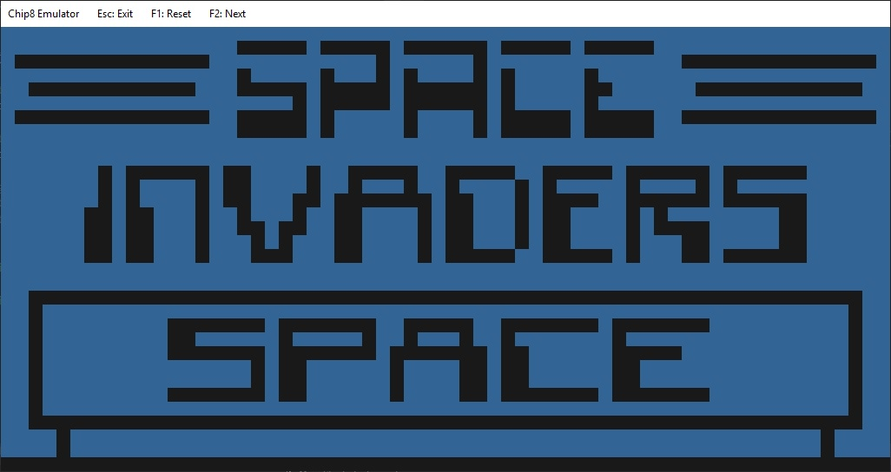

# CHIP8
A simple CHIP8 emulator in C++ ( std17 ) and SFML

# Folders content
- SRC ( source code )
- SFML ( include, lib, dll )
- RES ( sound file )
- ROMS ( some Chip8 games )

## Usage
- Esc : quit
- F1 : reset
- F2 : load next rom

## Keyboard mapping
1 2 3 4&nbsp;&nbsp;&nbsp;&nbsp;&nbsp;&nbsp;&nbsp;=>&nbsp;&nbsp;&nbsp;&nbsp;&nbsp;1 2 3 C 
Q W E R&nbsp;&nbsp;&nbsp;&nbsp;&nbsp;=>&nbsp;&nbsp;&nbsp;&nbsp;&nbsp;4 5 6 D 
A S D F&nbsp;&nbsp;&nbsp;&nbsp;&nbsp;&nbsp;=>&nbsp;&nbsp;&nbsp;&nbsp;&nbsp;7 8 9 E 
Z X C V&nbsp;&nbsp;&nbsp;&nbsp;&nbsp;&nbsp;=>&nbsp;&nbsp;&nbsp;&nbsp;&nbsp;A 0 B F 